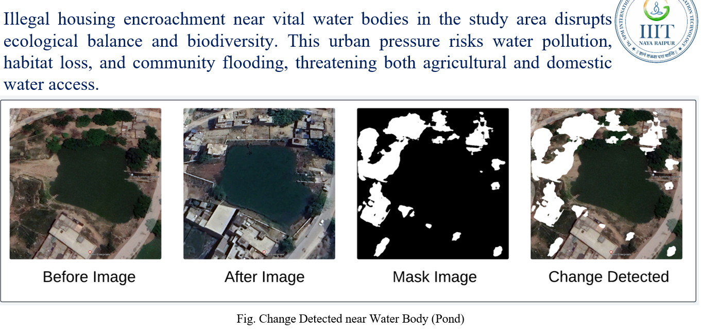

 
<H1 align =center>Landscapre Change Detection </H1>

"Leveraging UNet Model"

  

This project focuses on leveraging U-Net-based deep learning models for detecting changes in land cover over time, which are crucial for effective environmental management and urban planning.
The project evaluates four U-Net-based architectures - Basic U-Net, Modular U-Net, U-Net++, and Light U-Net++ - for their performance in accurately delineating land cover changes.

# Applications - 

1. Accurate monitoring of agricultural land use changes to support sustainable farming.
   
 

2.	Identification of illegal constructions near water bodies for environmental protection.
   
 

3.	Tracking urban land use dynamics to inform sustainable urban development.
   
 

Made with :heart: at IIIT Naya Raipur
